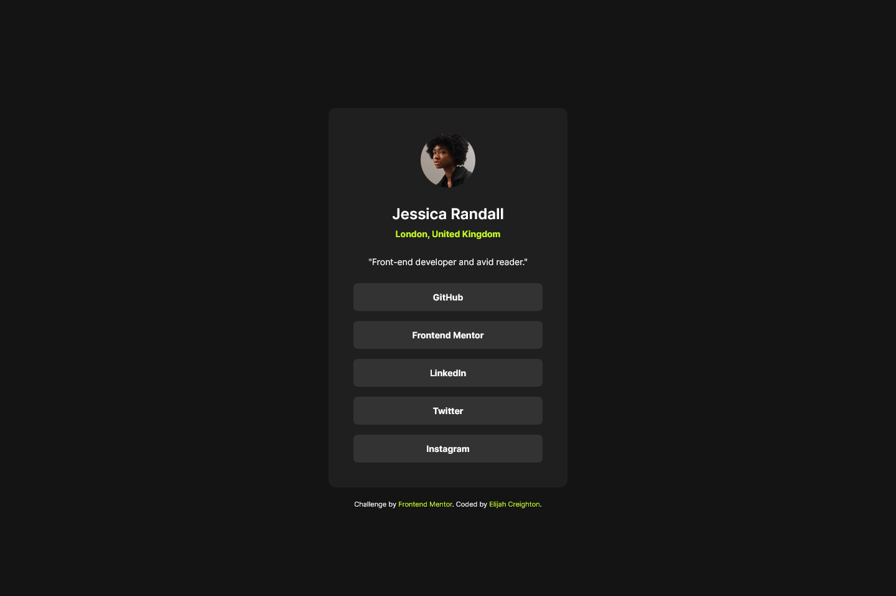

# Frontend Mentor - Social links profile solution

This is a solution to the [Social links profile challenge on Frontend Mentor](https://www.frontendmentor.io/challenges/social-links-profile-UG32l9m6dQ). Frontend Mentor challenges help you improve your coding skills by building realistic projects. 

## Table of contents

- [Overview](#overview)
  - [The challenge](#the-challenge)
  - [Screenshot](#screenshot)
  - [Links](#links)
- [My process](#my-process)
  - [Built with](#built-with)
  - [Continued development](#continued-development)
- [Author](#author)

## Overview

### The challenge

Users should be able to:

- See hover and focus states for all interactive elements on the page

### Screenshot

### Links

- [Solution](https://www.frontendmentor.io/solutions/social-links-profile-V0kUL9cBzd)
- [Live Site](https://creightoneli.github.io/Social-Links-Profile-FEM/)

## My process

### Built with

- Semantic HTML5 markup
- CSS custom properties
- Flexbox
- [Sass](https://sass-lang.com/) - CSS Preprocessor

### Continued development

As I stated in the last challenge I submitted, I wanted to work with and get to know Sass better. This time I did and I think I need a bit more time to figure it out, but I learned a lot. I plan to continue working on it and learn how to best implement more processes to automate my workflow. Maybe next I'd like to work on a larger challenge. This project almost felt too small to worry about using something like Sass. I ended up spending more time setting it up in my environment then I did actually creating the website. Next time the setup should go by a lot smoother now that I understand it better.

## Author

Find me here on GitHub or these other places:
- [Website](https://creightoneli.github.io/)
- [Frontend Mentor](https://www.frontendmentor.io/profile/CreightonEli)
- [LinkedIn](www.linkedin.com/in/creightone)